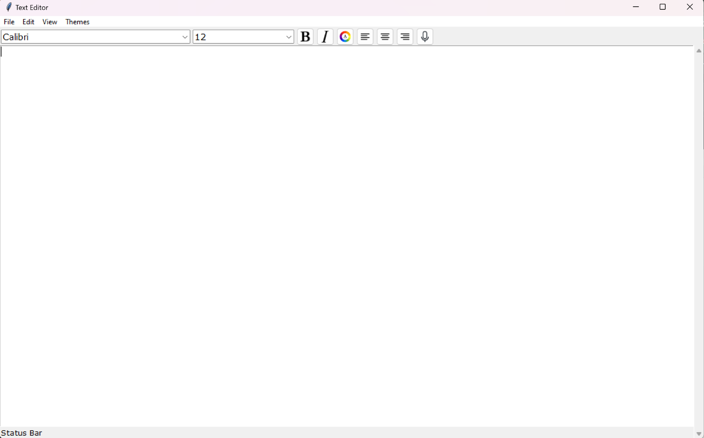
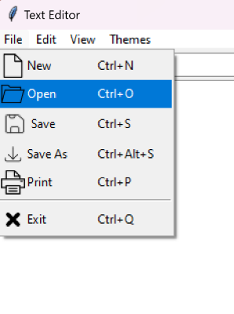
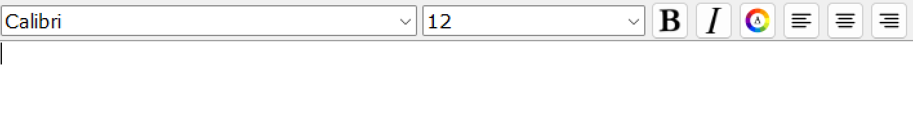
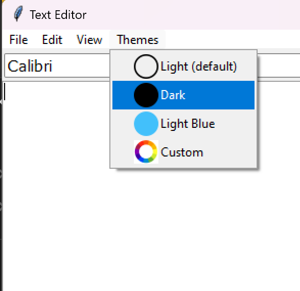
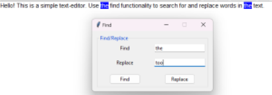
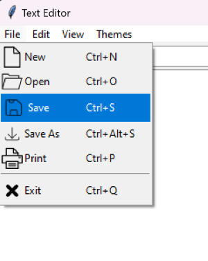

# Text-Editor
A simple text editor created using Python and Tkinter

## Description

Text-Editor is a simple text editor program built using Python and tkinter. It provides essential features and functionalities for editing and formatting text.

## Features

- **Resizable Window**: The text editor window has a size of 1200x700 pixels.
- **File Operations**: Load and save files from the hard drive, allowing users to work with existing text files or create new ones.
- **Font and Font Size**: Change the font family, font color, and font size of the text to suit your preferences.
- **Themes**: Choose between default and custom themes to personalize the appearance of the text editor.
- **Text to Speech**: Utilize the text-to-speech feature to listen to the text content.
- **Text Formatting**: Apply formatting styles such as bold and italics to text.
- **Text Alignment**: Align the text to the left, center, or right.
- **Find and Replace**: Easily search for specific words or phrases in the text and replace them as needed.

## Usage

1. Launch the text editor program.
   

2. Open an existing text file or create a new one using the file operations.
   

3. Customize the font family and font size. Use the text formatting options to apply bold, italic, or alignment to the text.
   

4. Choose the desired text-editor theme.
   

5. Use the find and replace functionality to search for and replace specific words or phrases.
   

6. Utilize the text-to-speech feature to listen to the text content.

7. Save your changes or create a new file as needed.
   

## Supported File Types

- .txt
- .py
